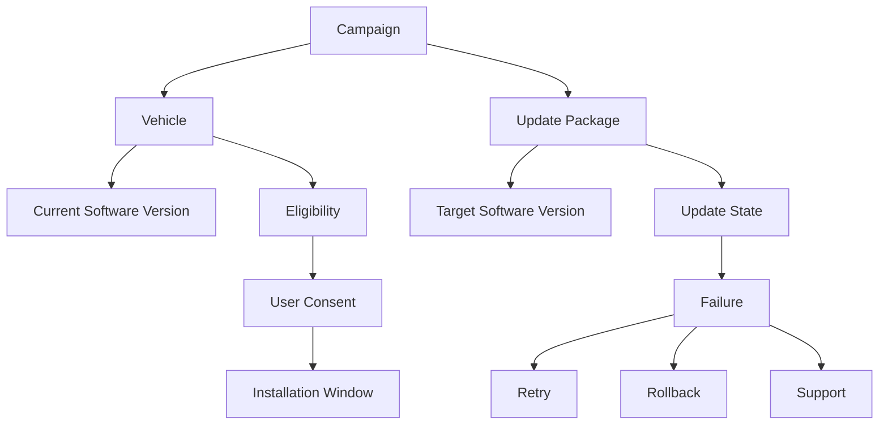

# OTA Ontology v2

This example models OTA updates from the world first.

It does not start with screens, APIs, jobs, queues, or database tables.

Those belong to design, architecture, and implementation.

The ontology starts with the product world that must be understood before those choices are made.

## Source PRD Knowledge

A PRD for OTA usually contains:

- Intent: keep vehicle software safe, current, and reliable after delivery.
- Requirements: deliver updates, inform users, install safely, recover from failure.
- Assumptions: vehicles may be offline, users may delay updates, hardware differs by model.
- Constraints: safety rules, battery limits, network availability, legal and regional rules.

The ontology extracts the shared model already implicit in those points.

## Concepts

| Concept | Meaning |
| --- | --- |
| Vehicle | The physical product that receives software updates. |
| Software Version | A specific released version of vehicle software. |
| Update Package | The deliverable that changes software on a vehicle. |
| Campaign | A planned rollout of an update to a target population. |
| Eligibility | The judgment that a vehicle can receive an update. |
| Installation Window | The allowed time or condition for installing an update. |
| User Consent | The user's permission or scheduling choice when required. |
| Update State | The current progress of an update for a vehicle. |
| Failure | A condition that prevents successful update completion. |
| Rollback | A return to a previous safe software version or configuration. |

## Relationships

- A Campaign targets Vehicles.
- A Vehicle has a Software Version.
- A Campaign offers an Update Package.
- An Update Package moves a Vehicle from one Software Version to another.
- Eligibility determines whether a Vehicle can receive an Update Package.
- User Consent may be required before installation.
- An Installation Window constrains when installation may happen.
- Update State describes the progress of an Update Package on a Vehicle.
- Failure may trigger Retry, Support, or Rollback.

## Rules

Constraints that hold regardless of which action is being attempted.

- A campaign must define its target population.
- A vehicle should report update state changes.
- A failure must leave the vehicle in a known safe state.

## States

An OTA update can move through these states:

- Not eligible
- Eligible
- Offered
- Accepted
- Scheduled
- Downloading
- Downloaded
- Installing
- Installed
- Failed
- Retrying
- Rolled back
- Canceled

These states describe the world.

They do not decide whether the implementation uses a state machine, workflow engine, message queue, or service callback.

## Actions

The named, legitimate ways an Update Package moves a Vehicle from one state to another. Each action is guarded by conditions that must hold before it is allowed to happen.

| Action | Moves | Guard |
| --- | --- | --- |
| Offer Update | Eligible → Offered | Vehicle must be eligible. |
| Accept Update | Offered → Accepted | User Consent given, if required. |
| Schedule | Accepted → Scheduled | Must fall within the Installation Window. |
| Install | Downloaded → Installing → Installed | Safety conditions met; minimum battery or power conditions met. |
| Retry | Failed → Retrying | — |
| Rollback | Failed → Rolled back | Must be available whenever the update could leave the vehicle unusable or unsafe. |
| Cancel | Any pre-install state → Canceled | — |

Naming these separately from Rules makes explicit who or what triggers a transition, not just what must be true before it can happen.

## Implementation Is Downstream

Ontology says:

- A vehicle has eligibility.
- An update has states.
- Install, Rollback, and the other actions are the legitimate ways between them.
- Safety rules constrain installation.
- Failure must be handled.

Implementation decides:

- which services own the data,
- which APIs expose it,
- which events are emitted,
- which database tables persist it,
- and which jobs execute the rollout.

Keeping those separate prevents the ontology from becoming architecture too early.

## Ontology-Driven Questions

- What makes a vehicle eligible or ineligible?
- Who can override eligibility?
- Which safety conditions block installation?
- What user consent is legally or ethically required?
- What states must be visible to the user?
- What states must be visible to support teams?
- What failures require rollback?
- What failures require human support?
- What must be true before a campaign can begin?
- What evidence proves an update completed successfully?
- Who or what is authorized to trigger Install? Rollback?

## Working Standard

If a detail describes the product world, keep it in the ontology.

If a detail describes how software will be built, move it to design, architecture, implementation, or testing.
