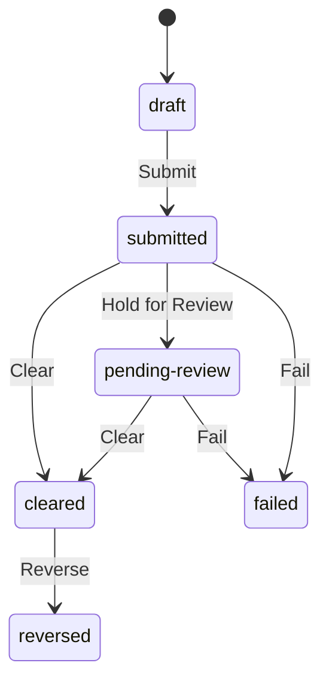

# Worked Example: Send Money (P2P Transfer)

A complete run of [the ODPM method](../../ODPM-method.md) on one feature, start to finish. The PRD below is fictional but realistic; nothing here is a real product.

The point is not the payments domain. The point is to see one artifact travel the whole cycle:

```text
source artifact → ontology → open questions → Chase Understanding → Decision Readiness → execution → ontology update
```

---

## Step 1 — The Source Artifact

An excerpt from a fictional PRD, *"Send Money v1"*:

> **Intent.** Let a customer send money to another customer instantly, from their phone.
>
> **Requirements.** The sender picks a recipient and an amount, confirms, and the money moves. Sending is subject to a daily limit. Senders must be identity-verified. Transfers are reversible if something goes wrong.
>
> **Assumptions.** Both parties are existing, verified customers. Same currency only.
>
> **Constraints.** Cannot send more than the daily limit. Cannot send more than the available balance. Fraudulent transfers must be catchable before the money is gone.

That is enough intent to extract a model — and, as we'll see, enough ambiguity to produce real open questions.

---

## Step 2 — Extract the Ontology

Reading the PRD through the five building blocks (see the [Ontology Canvas](../../templates/ontology-canvas.md)).

### Concepts

| Concept | Meaning |
|---|---|
| Sender | A verified customer initiating a transfer |
| Recipient | A verified customer receiving a transfer |
| Account | Where a customer's balance lives |
| Transfer | A movement of funds from one account to another |
| Daily Limit | The most a sender may send in a day |
| KYC Status | Whether a customer is identity-verified |

### Relationships

- A Sender owns an Account.
- A Transfer moves funds from the sender's Account to the recipient's Account.
- A Daily Limit constrains a Sender's Transfers.
- KYC Status governs whether a Sender may transfer at all.

### Rules

Constraints that must always hold, independent of any single action.

- A Sender must have completed KYC before sending.
- A Transfer amount must be positive.
- A Transfer cannot exceed the sender's available balance.
- A Transfer cannot exceed the sender's Daily Limit.
- Sender and Recipient accounts must be in the same currency.

### States

The lifecycle of a Transfer. Each arrow is an Action from the table below; `draft` is the initial state.



### Actions

Named, legitimate transitions — each with an actor and a guard (what must be true first).

| Action | Actor | From → To | Guard |
|---|---|---|---|
| Submit | Sender | draft → submitted | KYC complete; within limit; sufficient balance |
| Hold for Review | System | submitted → pending-review | a fraud signal fired |
| Clear | System | submitted / pending-review → cleared | fraud check passed |
| Fail | System | submitted / pending-review → failed | downstream rejection |
| Reverse | _(unclear — see open questions)_ | cleared → reversed | _(unclear)_ |

Notice the last row. The PRD says transfers are "reversible," but the moment we try to name Reverse as an Action, we cannot fill in the actor or the guard. That gap is invisible in the prose and glaring in the ontology.

---

## Step 3 — Mark Open Questions

Everything unclear, disputed, missing, or assumed goes to the [Open Question Log](../../templates/open-question-log.md).

| ID | Question | Kind | Owner | Status |
|----|----------|------|-------|--------|
| Q1 | Who can trigger **Reverse**, and within what window? | intent-gap | PM | chasing |
| Q2 | Does the Daily Limit reset at midnight local time or UTC? | intent-gap | PM | chasing |
| Q3 | Is there a different limit for new vs. established accounts? | intent-gap | PM | open |
| Q4 | Does the existing ledger support a hold, or is `pending-review` a new capability? | evidence-gap | Eng | chasing |

Q1 and Q4 are the interesting ones. Q1 is an **Action with no actor** — the kind of gap only the Action building block surfaces. Q4 is an **evidence-gap**: the PRD assumes a capability that may or may not exist in the code.

---

## Step 4 — Chase Understanding

Take the questions to the people who can answer them.

- **Q1 (Reverse):** Resolved with the PM and compliance. Reverse is **support-initiated only**, within a **24-hour window** after clearing. This turns the empty row into a real Action: `Reverse | Support agent | cleared → reversed | within 24h of clearing`.
- **Q2 (limit reset):** Resolved — **UTC midnight**, to match the ledger's day boundary.
- **Q4 (ledger hold):** Resolved by checking the code with Eng — the ledger **already supports holds**, so `pending-review` is not new work. Good news the PRD couldn't have told us.
- **Q3 (new-account limit):** Deliberately left open, and **accepted as a risk** for v1: one limit for everyone now, revisit if fraud data warrants it. Owner and rationale recorded.

Each resolution is written back into the ontology — the Reverse row is now complete, and a `Daily Limit resets at UTC midnight` rule is added.

---

## Step 5 — Decide Readiness

Apply the [Decision Readiness Checklist](../../templates/decision-readiness-checklist.md). The decision: *ship Send Money v1.*

- [x] **Point to the model.** The ontology above is the model — concepts, relationships, rules, states, and actions are all named.
- [x] **Show what is uncertain.** One open question remains: Q3 (new-account limit).
- [x] **Show who owns each uncertainty.** Q3 has the PM as owner, marked accepted-risk with a rationale.
- [x] **Explain why the unknowns no longer block.** v1 uses a single limit deliberately; the ledger-hold question (Q4) is confirmed resolved; reversal (Q1) is fully specified.

All four boxes check. The team is **Decision Ready** — not because everything is known, but because the one remaining unknown is owned and does not block shipping.

---

## Step 6 — Execute

Build from the model everyone can point to: Submit, Hold for Review, Clear, Fail, and the now-specified Reverse. The state machine mirrors the ontology's States; the guards mirror the Rules. Nothing in the build re-interprets what a "Transfer" is — the ontology already settled that.

---

## Step 7 — Update the Ontology from Feedback

Execution tests the ontology. Within weeks, production surfaced something the model missed: some transfers sat in `submitted` indefinitely when a downstream service never responded — neither cleared nor failed.

That is a **missing state and a missing action**. The ontology is updated:

- New State: `expired`.
- New Action: `Expire | System | submitted → expired | no downstream response within the timeout`.

The gap was found in reality and written back into the model — so the next run starts from a truer one. This is step 7, and it is why every artifact in ODPM is a snapshot, not a final answer.

---

## What This Run Produced

Not a feeling of alignment — specific, checkable outputs:

- **An unnamed action surfaced.** "Reversible" hid a Reverse action with no actor; naming it forced a real compliance decision (support-only, 24h).
- **An evidence-gap closed.** The PRD assumed a ledger capability; checking the code confirmed it, avoiding wasted design.
- **A risk made explicit.** The new-account limit question was accepted, owned, and recorded — not silently dropped.
- **A missing state caught in production** and fed back, improving the model for the next feature.

Every one of those is expressible as work, not vibes. That is the test the method is built to pass.

---

See also: [The ODPM Method](../../ODPM-method.md) · [Ontology Canvas](../../templates/ontology-canvas.md) · [Open Question Log](../../templates/open-question-log.md) · [Decision Readiness Checklist](../../templates/decision-readiness-checklist.md)
