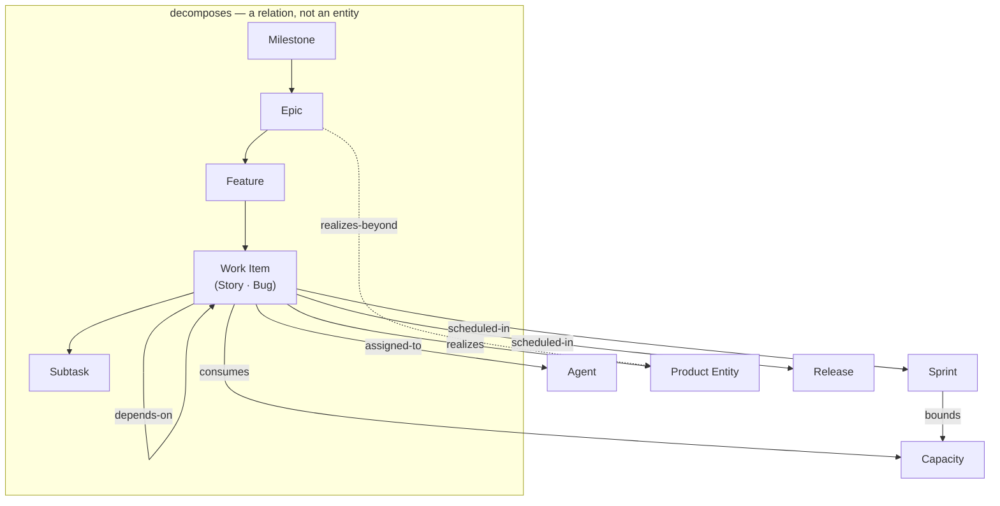

# Project Management Domain Ontology

A worked ontology of software product and project **delivery** — Stories, Bugs, Sprints, and the rest — modeled with ODPM's five building blocks.

> **This is a domain ontology built _with_ ODPM, not part of ODPM.**
> It specializes the generic project ontology (Snapshot 013, *What Is a Project?*) to one domain: software delivery. The base — the five building blocks, the method, the project invariants — stays domain-independent. The PM-specific terms (Story, Bug, Sprint, Epic) live here, as *instances* of base entities. Nothing here climbs into the base.

Two domains, two examples: the [banking send-money](../banking/send-money-p2p.md) example models a *product* world (Transfer, Account). This models the *delivery* world — the work of building any product.

---

## Entities

The things that exist in delivery. Each is an **Entity** — the base building block — playing a particular role (the role names come from Snapshot 013's formal lens; they are sub-kinds of Entity, not blocks beside it).

| Entity | Building block · role | Meaning |
|---|---|---|
| Work Item | Entity · *understanding-unit* | the atom of delivery; **Story** and **Bug** are its two shapes |
| Story | Entity · *understanding-unit* | a work item that realizes *new* product understanding |
| Bug | Entity · *understanding-unit* | a work item that restores understanding↔reality alignment — a divergence to close |
| Product Entity | Entity | what a work item realizes (the bridge; a `product_entity_id`) |
| Agent | Entity · *actor* | who transforms — assignee, reviewer, QA |
| Sprint | Entity · *constraint* | a time-boxed capacity window over a set of work items |
| Capacity | Entity · *constraint* | available effort (time / people) in a Sprint |
| Release | Entity · *artifact* | verified work delivered to users |

### What is *not* an Entity

Per Snapshot 013, **Epic, Feature, and Milestone are not entities — they are groupings**, i.e. relationships over work items. They live under Relations below.

> Falsifiable claim: if an Epic carries a property not derivable from its members (its own state, its own owner-of-record), promote it to an Entity. Today's typical data model suggests it stays a relation.

---

## Relations

Where delivery actually gets hard.

- **realizes** — Work Item → Product Entity. The bridge from delivery to product. A story with no entity realizes nothing nameable.
- **decomposes** — the grouping tree: Milestone ⊃ Epic ⊃ Feature ⊃ Story ⊃ Subtask. *Epic / Feature / Milestone are this relation, not entities.*
- **depends-on** — Work Item → Work Item. Its bad state *is* "blocked" — which is why a blocker always points at another item, never at the item itself.
- **consumes** — Work Item → Capacity. The edge PMBOK obsesses over and most boards leave implicit.
- **assigned-to** — Work Item → Agent.
- **scheduled-in** — Work Item → Sprint or Release.
- **bounds** — Sprint → Capacity. A Sprint bounds the effort available inside it.
- **realizes-beyond** — an Epic realizing more than its Stories define: the **+scope** overflow, a relation the agreement failed to record.

> Most project pain lives here, in the relations — not in the Stories themselves.

---

## States

The conditions a Work Item moves through. The observable lifecycle:

```text
backlog → ready → in progress → in review → qa → done
```

A `done` item that a bug reopens drops to **diverged**, then re-enters at `in progress` and climbs back to `done` once the fix is verified.

Its deep structure (from the base) is three phases:

```text
intended → enacted → verified
```

`done` = **verified**, never merely claimed. And the critical, usually-invisible distinction: **Observed vs. Actual** — "qa pass" is observed-realized; a field bug is the actual reality having diverged.

Other lifecycles:

- **Bug:** `open → triaged → fixed → verified-fixed` — or `triaged → entity-updated` when the model, not the code, was wrong. (Its transitions are named Triage, Fix, Verify-fix.)
- **Sprint:** `planned → active → closed`. Unfinished items return to backlog on close.
- **Dependency** (a state of the *relation*, not the item): `satisfied` / `blocking`. A `blocking` dependency is what makes a Work Item "blocked."

---

## Actions

Named, legitimate transitions — each with an actor and a guard.

| Action | Actor | From → To | Guard |
|---|---|---|---|
| Refine | PO / team | backlog → ready | references a Product Entity; acceptance criteria defined (Decision Ready) |
| Start | developer | ready → in progress | no `blocking` dependency; capacity remains |
| Submit for Review | developer | in progress → in review | implementation complete |
| Approve Review | reviewer | in review → qa | review approved |
| Verify (QA Pass) | QA | qa → done (verified) | behaves as its acceptance criteria / Product Entity say |
| Report Bug | anyone | done → diverged | observed divergence from the model |
| Fix Divergence | developer | diverged → in progress | — |
| Close Sprint | lead | active → closed | Sprint timebox elapsed |

> **Relation-establishing actions** (not lifecycle transitions): **Schedule** creates a `scheduled-in` link to a Sprint or Release, guarded by remaining Capacity; **Assign** creates an `assigned-to` link to an Agent. Neither changes the item's state.
>
> **Side effects:** Report Bug also creates a Bug in `open`; closing a Sprint returns its unfinished items to backlog.
>
> Transitions with no human actor — a dependency clearing, a Sprint timing out — are system/time triggered. The team observes them; it does not cause them.

---

## Rules / Invariants

What must hold in every valid state. Inherited from the project ontology (Snapshot 013), specialized to delivery.

- **Done means verified, never claimed.** No Story is done until QA confirms it matches its acceptance criteria. (The qa-pass discipline, as law.)
- **Every done Work Item realizes a Product Entity** (the coverage invariant). Realized work with no entity is scope creep or a missing entity — there is no third case.
- **Consumed capacity never exceeds Sprint capacity.** Over-commit is not "behind"; it is a broken Sprint.
- **A Bug is a divergence, typed by the building block it violates** — broken Rule / impossible State / unguarded Action / missing Entity or Relationship. (From Snapshot 011.) The type tells you whether to fix the code or the model.
- **Understanding only increases.** A reopened or failed item is a gain — you learned the acceptance criteria were wrong. Never a step backward.

---

## The Map



---

## The Gate, Demonstrated

This ontology is the layer discipline in action:

- **Stays in the domain:** Story, Bug, Epic, Sprint, Release, Capacity, "qa pass." These are PM's *instances* of base blocks; they do not belong in ODPM itself.
- **Belongs to the base:** Work-item-as-understanding-unit, the five building blocks, and the invariants (done=verified, coverage, understanding-only-increases). These hold for *any* project, not just software delivery.

A domain term earns a place in the base only by proving it holds for non-PM projects too. Story does not; it stays here.

---

See also: [The ODPM Method](../../ODPM-method.md) · [Tracking Against the Ontology](../../snapshots/011-tracking-against-the-ontology.md) · [ODPM and Scrum](../../principles/odpm-and-scrum.md) · [Glossary](../../glossary.md) · [Banking: Send Money (a product-domain ontology)](../banking/send-money-p2p.md)
