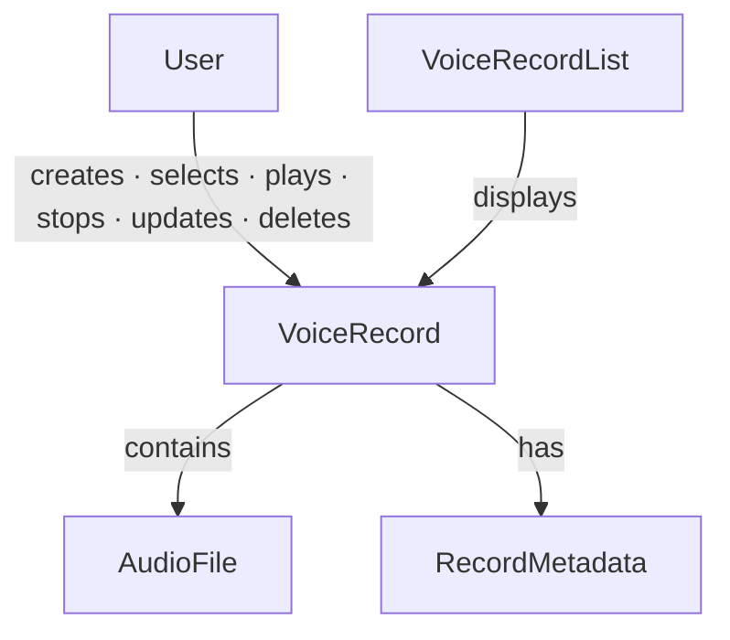

# Voice Journal — a Worked ODPM Example

*A complete example of applying the Ontology-Driven Practice Model (ODPM) to a small but realistic product — and then building it, so it doubles as field evidence for ODPM's core bet.*

---

## About ODPM

Ontology-Driven Practice Model (ODPM) is a discipline for cultivating shared understanding before taking action.

Instead of beginning with implementation artifacts — user interfaces, APIs, database schemas, software architecture — ODPM begins by understanding the domain itself.

Every practice starts with the same five questions:

1. What **concepts** exist?
2. How are those concepts **related**?
3. What **actions** are allowed?
4. What **states** can those concepts be in?
5. What **rules** govern the domain?

The resulting ontology becomes the shared understanding that guides every subsequent decision — from product discovery and software design to implementation and future evolution.

---

## Why This Example?

A voice journal is intentionally simple. Most people can understand its purpose within minutes, which makes it ideal for demonstrating the complete ODPM process without the complexity of an enterprise system.

Although the product is small, it contains every essential building block: Concepts, Relationships, Actions, States, and Rules.

---

## Product Intention

The product helps users capture short voice thoughts before they are forgotten.

The guiding principle is:

> **Capture first. Organize later.**

Recording should never be blocked by titles, descriptions, tags, AI processing, or other metadata.

*(Notice how much weight this single line carries — it does more design work than the entire concept graph. See [The Intention Gap](#the-intention-gap).)*

### User Stories

**Story 1 — Capture an Idea**
As a user, I want to record a voice note immediately, so that I can capture an idea before I forget it.

**Story 2 — Revisit My Thoughts**
As a user, I want to browse and play my previous voice records, so that I can revisit my thoughts whenever I need them.

**Story 3 — Organize My Records**
As a user, I want to edit the title or description and remove voice records when necessary, so that I can keep my journal organized over time.

Together these define the MVP scope:

1. Capture thoughts quickly.
2. Retrieve thoughts easily.
3. Organize thoughts when appropriate.

Everything else — AI transcription, summarization, semantic search, intelligent tagging, cloud synchronization — is a future enhancement, not part of the MVP.

---

## Concepts

*(In formal-ontology terms these are entities; ODPM keeps the plain word — see [One Concept, Not Two](../../principles/one-concept-not-two.md).)*

### User

The person who records and manages voice thoughts.

### VoiceRecord

A single captured voice thought. **This is the central concept of the domain** — every meaningful interaction revolves around it.

### AudioFile

The recorded audio associated with a VoiceRecord.

### RecordMetadata

Optional information describing a VoiceRecord. Typical attributes:

- title
- description
- createdAt
- updatedAt
- duration

### VoiceRecordList

A collection that displays existing VoiceRecords.

---

## Relationships

**User**

- creates → VoiceRecord
- selects → VoiceRecord
- plays → VoiceRecord
- stops → VoiceRecord
- updates → VoiceRecord
- deletes → VoiceRecord

**VoiceRecord**

- contains → AudioFile
- has → RecordMetadata

**VoiceRecordList**

- displays → VoiceRecord

---

## Actions

- Record Voice
- Stop Recording
- Save VoiceRecord
- View VoiceRecordList
- Select VoiceRecord
- Play VoiceRecord
- Stop Playback
- Update Metadata
- Delete VoiceRecord(s)

---

## States

**VoiceRecord**

- Recording
- Saved
- Playing
- Paused
- Updating
- Deleted

**Application**

- Idle
- Recording
- Playback
- Selection Mode
- Metadata Editing

---

## Rules

### R1 — Capture First

Recording begins immediately. The user is never required to provide a title, description, tags, AI summary, or transcription before recording.

### R2 — Metadata is Optional

A VoiceRecord may exist without a title or description.

### R3 — Default Display Name

When no title is provided, display:

> `Untitled Log — YYYY/MM/DD HH:mm`

### R4 — Audio is Required

Every VoiceRecord contains exactly one AudioFile.

### R5 — Playback

Only saved VoiceRecords may be played.

### R6 — Metadata Editing

Title and description may be updated after recording. The audio itself is immutable in the MVP.

### R7 — Deletion

Users may delete one or multiple VoiceRecords.

### R8 — Single Recording Session

Only one recording session may be active at any time.

### R9 — AI is an Extension

Capabilities such as transcription, summarization, title generation, semantic search, and tagging are future extensions and must never interrupt the primary recording workflow.

---

## The Domain Ontology

On paper, this looked complete. Then it was built.

---

## The Learning Log — What Realizing It Revealed

Building the MVP surfaced five gaps. **Every one was a relationship, and every one was a _dynamic_ relationship** — concurrency, exclusion, causation, side-effects, state/behavior coherence — the kind invisible by inspection that only appears when the system runs. The Concepts were right; the *verbs between the verbs* were missing.

Each finding follows the ODPM loop: **observation → ontology impact → rule candidate**.

### Finding 1 — Playback is not an exclusive App State

- **Observation:** playback can run alongside other modes — the user can browse the list or enter Selection Mode while a record plays.
- **Ontology impact:** `Playback` shouldn't be an exclusive Application State. Split the axes:
  - App Mode: `Idle` · `Recording` · `SelectionMode` · `MetadataEditing`
  - Playback State: `Stopped` · `Playing`
- **Rule candidate (R10):** playback may continue while browsing or selecting, unless the action conflicts with the playing record.

### Finding 2 — `Paused` is not supported in MVP

- **Observation:** the ontology lists `Paused`, but the MVP defines only play and stop. There is no Pause action — a **dangling state**.
- **Ontology impact:** remove `Paused` from MVP states; defer to Future Evolution.
- **Rule candidate (R11):** MVP playback supports only `Playing` and `Stopped`.

### Finding 3 — Stop Recording means Save

- **Observation:** the ontology defines Stop Recording and Save, but no Discard — so stopping *always* saves. An **implied relationship** left unstated.
- **Ontology impact:** make the Stop→Save relationship explicit.
- **Rule candidate (R12):** stopping a recording creates and saves a VoiceRecord automatically; Discard is excluded unless added later.

### Finding 4 — Recording and Playback conflict

- **Observation:** starting a recording stops any active playback — an **unmodeled interaction/priority** between two state machines.
- **Ontology impact:** recording and playback aren't independent; recording has priority.
- **Rule candidate (R13):** starting a recording must stop active playback first.

### Finding 5 — Deleting a playing record

- **Observation:** deleting the currently-playing record must stop playback first — an **unmodeled side-effect** of Delete.
- **Ontology impact:** Delete has a side-effect when applied to the playing record.
- **Rule candidate (R14):** deleting the currently-playing VoiceRecord must stop playback before deletion.

> Rules R10–R14 **precipitated out of realization** — each traceable to a specific runtime collision. That is the ODPM loop's output signature: `decision → finding → rule candidate → ontology amendment`.

### The Gap-Pattern Checklist (earned here)

The five findings share a shape, and it generalizes into a check to run *after* drafting an ontology and *before* building. All five would have been caught up front:

1. **Every state:** exclusive or concurrent with the others? *(F1)*
2. **Every state:** does a behavior both produce *and* consume it? *(F2 — dangling states)*
3. **Every pair of behaviors:** does one imply the other? *(F3)*
4. **Every pair of subsystems / state machines:** what's their priority or exclusion rule when both are active? *(F4)*
5. **Every behavior:** what states does it disturb *besides* its target? *(F5 — side-effects)*

The five questions ODPM starts with collect *static* relationships cleanly but systematically miss *dynamic* ones. This checklist is the earned hardening — a better question set, derived from evidence, not theory.

### The Intention Gap

One more hole, of a different kind. **"Capture first. Organize later."** — a single sentence of value-ordering — did more UX design work than the whole concept graph. The ontology captures *structure* (what the domain is), not *intention* (what it's for, what matters, what to build first). ODPM currently smuggles intention in via the user stories sitting on top of the ontology. Worth naming as a known gap, not papering over.

---

## Future Evolution

The ontology remains stable even as the product evolves. New capabilities are introduced by **adding** concepts and relationships rather than modifying existing ones:

- VoiceRecord — has → **Transcript**
- VoiceRecord — produces → **Insight**
- VoiceRecord — indexed by → **SearchIndex**

The product grows without changing the meaning of its core concepts. `Paused` (deferred in F2) re-enters here as an explicit behavior when the time comes.

---

## ODPM Reflection

This example demonstrates the central philosophy of ODPM.

A conventional software process typically starts by discussing screens, APIs, database tables, or implementation details. ODPM starts somewhere else — by building a shared understanding of the domain. Once the concepts, relationships, actions, states, and rules are understood, implementation becomes a matter of expressing that understanding through software.

Here, `VoiceRecord` naturally emerged as the central concept — not because of a database design or class hierarchy, but because every meaningful interaction in the domain revolves around it. The resulting ontology is small, stable, and easy to evolve.

> **Understand the domain before designing the solution.**

The ontology is not another project artifact. It is the shared understanding that connects intention, design, implementation, and future evolution. Everything else is simply an implementation of that understanding.

And the sharper lesson — the one only building could teach: the ontology wasn't just *implemented*, it was *completed* by being run. Five dynamic relationships that no amount of inspection would have surfaced announced themselves as concrete runtime collisions, each becoming a named rule. The build was a **discovery instrument for the ontology**, not merely an expression of it. That is why "Execute" and "Update from feedback" (method steps 6–7) are not afterthoughts but where a whole class of understanding is *found*.

---

See also: [The ODPM Method](../../ODPM-method.md) · [Tracking Against the Ontology](../../snapshots/011-tracking-against-the-ontology.md) · [One Concept, Not Two](../../principles/one-concept-not-two.md) · [Banking: Send Money](../banking/send-money-p2p.md) · [Project Management Domain Ontology](../project-management/ontology.md)
