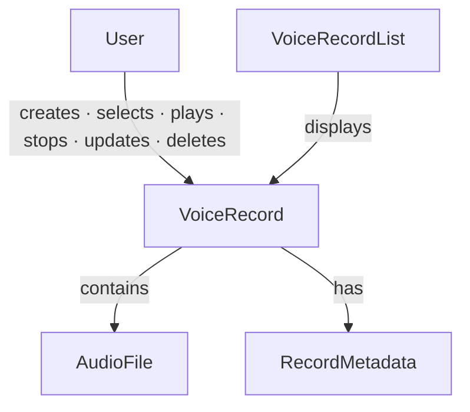

# Voice Journal — a Worked ODPM Example

A small, realistic product modeled the ODPM way — and then *built*, so it doubles as evidence for ODPM's core bet: some understanding is only reachable by realizing it. The drafted ontology is below; [what building it revealed](#the-learning-log--what-realizing-it-revealed) follows.

A voice journal is intentionally simple — understandable in minutes — yet it contains every building block: Concepts, Relationships, Rules, States, Actions.

---

## Product Intention

The product helps users capture short voice thoughts before they are forgotten.

> **Capture first. Organize later.**

Recording is never blocked by titles, descriptions, tags, AI processing, or other metadata.

*(Note the weight this one line carries — see the [intention gap](#the-intention-gap) below. One sentence of value-ordering did more design work than the entire concept graph.)*

### User Stories

1. **Capture an idea** — record a voice note immediately, before it's forgotten.
2. **Revisit my thoughts** — browse and play previous voice records.
3. **Organize my records** — edit title/description and delete records over time.

Everything else — transcription, summarization, semantic search, tagging, cloud sync — is future enhancement, not MVP.

---

## The Ontology

### Concepts

| Concept | Meaning |
|---|---|
| **User** | the person who records and manages voice thoughts |
| **VoiceRecord** | a single captured voice thought — the central concept of the domain |
| **AudioFile** | the recorded audio associated with a VoiceRecord |
| **RecordMetadata** | optional info describing a VoiceRecord (title, description, createdAt, updatedAt, duration) |
| **VoiceRecordList** | a collection that displays existing VoiceRecords |

### Relationships

- **User** creates / selects / plays / stops / updates / deletes → **VoiceRecord**
- **VoiceRecord** contains → **AudioFile**
- **VoiceRecord** has → **RecordMetadata**
- **VoiceRecordList** displays → **VoiceRecord**

### Actions

Record Voice · Stop Recording · Save VoiceRecord · View VoiceRecordList · Select VoiceRecord · Play VoiceRecord · Stop Playback · Update Metadata · Delete VoiceRecord(s)

### States

- **VoiceRecord:** Recording · Saved · Playing · Paused · Updating · Deleted
- **Application:** Idle · Recording · Playback · Selection Mode · Metadata Editing

### Rules

- **R1 — Capture First.** Recording begins immediately; no title/description/tags/AI required first.
- **R2 — Metadata is Optional.** A VoiceRecord may exist without a title or description.
- **R3 — Default Display Name.** With no title, show `Untitled Log — YYYY/MM/DD HH:mm`.
- **R4 — Audio is Required.** Every VoiceRecord contains exactly one AudioFile.
- **R5 — Playback.** Only saved VoiceRecords may be played.
- **R6 — Metadata Editing.** Title/description are editable after recording; the audio is immutable in the MVP.
- **R7 — Deletion.** Users may delete one or multiple VoiceRecords.
- **R8 — Single Recording Session.** Only one recording session may be active at any time.
- **R9 — AI is an Extension.** Transcription, summarization, title generation, search, tagging are future extensions and must never interrupt the primary recording workflow.

### The Map

On paper, this looked complete. Then it was built.

---

## The Learning Log — What Realizing It Revealed

Building the MVP surfaced five gaps. **Every one was a relationship, and every one was a _dynamic_ relationship** — concurrency, exclusion, causation, side-effects, state/behavior coherence — the kind that is invisible by inspection and only appears when the system runs. The Concepts were right; the *verbs between the verbs* were missing.

Each finding follows the ODPM loop: **observation → ontology impact → rule candidate**.

### Finding 1 — Playback is not an exclusive App State

- **Observation:** playback can run alongside other modes — the user can browse the list or enter Selection Mode while a record plays.
- **Ontology impact:** `Playback` shouldn't be an exclusive Application State. Split the axes:
  - App Mode: `Idle` · `Recording` · `SelectionMode` · `MetadataEditing`
  - Playback State: `Stopped` · `Playing`
- **Rule candidate (R10):** playback may continue while browsing or selecting, unless the action conflicts with the playing record.

### Finding 2 — `Paused` is not supported in MVP

- **Observation:** the ontology lists `Paused`, but the MVP defines only play and stop. There is no Pause action — a **dangling state**.
- **Ontology impact:** remove `Paused` from MVP states; defer to Future Evolution.
- **Rule candidate (R11):** MVP playback supports only `Playing` and `Stopped`.

### Finding 3 — Stop Recording means Save

- **Observation:** the ontology defines Stop Recording and Save, but no Discard — so stopping *always* saves. An **implied relationship** left unstated.
- **Ontology impact:** make the Stop→Save relationship explicit.
- **Rule candidate (R12):** stopping a recording creates and saves a VoiceRecord automatically; Discard is excluded unless added later.

### Finding 4 — Recording and Playback conflict

- **Observation:** starting a recording stops any active playback — an **unmodeled interaction/priority** between two state machines.
- **Ontology impact:** recording and playback aren't independent; recording has priority.
- **Rule candidate (R13):** starting a recording must stop active playback first.

### Finding 5 — Deleting a playing record

- **Observation:** deleting the currently-playing record must stop playback first — an **unmodeled side-effect** of Delete.
- **Ontology impact:** Delete has a side-effect when applied to the playing record.
- **Rule candidate (R14):** deleting the currently-playing VoiceRecord must stop playback before deletion.

> Rules R10–R14 **precipitated out of realization** — each traceable to a specific runtime collision. That is the ODPM loop's output signature: `decision → finding → rule candidate → ontology amendment`.

### The Gap-Pattern Checklist (earned here)

The five findings share a shape, and it generalizes into a check to run *after* drafting an ontology and *before* building. All five would have been caught up front:

1. **Every state:** exclusive or concurrent with the others? *(F1)*
2. **Every state:** does a behavior both produce *and* consume it? *(F2 — dangling states)*
3. **Every pair of behaviors:** does one imply the other? *(F3)*
4. **Every pair of subsystems / state machines:** what's their priority or exclusion rule when both are active? *(F4)*
5. **Every behavior:** what states does it disturb *besides* its target? *(F5 — side-effects)*

The five questions ODPM starts with collect *static* relationships cleanly but systematically miss *dynamic* ones. This checklist is the earned hardening — a better question set, derived from evidence, not theory.

### The Intention Gap

One more hole, of a different kind. **"Capture first. Organize later."** — a single sentence of value-ordering — did more UX design work than the whole concept graph. The ontology captures *structure* (what the domain is), not *intention* (what it's for, what matters, what to build first). ODPM currently smuggles intention in via the user stories sitting on top of the ontology. Worth naming as a known gap, not papering over.

---

## Future Evolution

The ontology stays stable as the product grows: add new concepts and relationships rather than modifying existing ones.

- VoiceRecord — has → **Transcript**
- VoiceRecord — produces → **Insight**
- VoiceRecord — indexed by → **SearchIndex**

The core concepts never change meaning. `Paused` (deferred from F2) re-enters here as an explicit behavior when the time comes.

---

## Why This Example Matters

Drafted, the ontology was small, stable, and clean — `VoiceRecord` emerged as the center not from a database design but because every interaction revolves around it. That is ODPM working as intended: understand the domain before designing the solution.

But the sharper lesson is what building it added. The ontology wasn't just *implemented* — it was *completed* by being run. Five dynamic relationships that no amount of inspection would have surfaced announced themselves as concrete runtime collisions, each becoming a named rule. The build was a **discovery instrument for the ontology**, not merely an expression of it.

That is the strongest field evidence yet for ODPM's core bet — and it's why "Execute" and "Update from feedback" (method steps 6–7) are not afterthoughts but where a class of understanding is *found*.

---

See also: [The ODPM Method](../../ODPM-method.md) · [Tracking Against the Ontology](../../snapshots/011-tracking-against-the-ontology.md) · [Banking: Send Money](../banking/send-money-p2p.md) · [Project Management Domain Ontology](../project-management/ontology.md)
