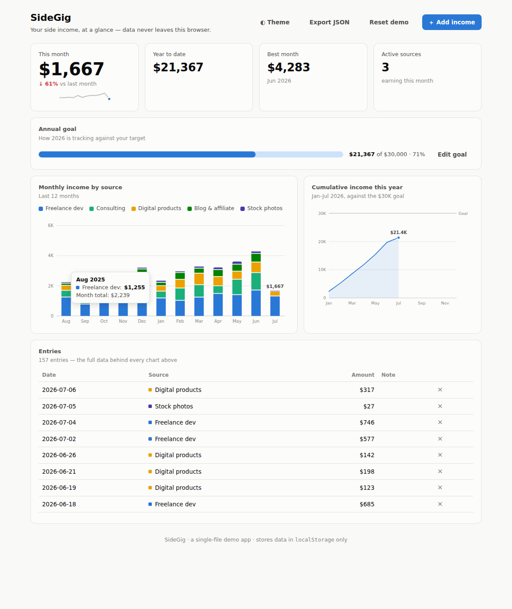

# SideGig — side-income dashboard

A polished, self-contained dashboard for tracking side-hustle income. One HTML
file, no build step, no backend, no accounts — your data lives in your
browser's `localStorage` and never leaves your machine.



## Features

- **KPI row** — this month's income (with delta vs last month and a 12-month
  sparkline), year-to-date total, best month, and active income sources.
- **Annual goal meter** — set a yearly target and watch the year track
  against it.
- **Monthly income by source** — stacked columns for the last 12 months with
  a legend and per-segment hover tooltips.
- **Cumulative line chart** — year-to-date income against the goal line,
  with a crosshair tooltip.
- **Entry log** — add, browse, and delete individual income entries; the
  table is the raw data behind every chart.
- **Export** — download all data as JSON at any time.
- **Dark mode** — follows your system theme, with a manual toggle
  (auto → dark → light).
- Ships with realistic demo data so the dashboard looks alive on first open;
  hit **Reset demo** to restore it.

## Run it

Open `index.html` in any modern browser. That's it.

To serve it locally instead:

```sh
python3 -m http.server 8000
# then visit http://localhost:8000
```

Or host it for free on GitHub Pages — the whole app is static.

## How it's built

- Vanilla HTML/CSS/JS in a single file — no frameworks, no dependencies.
- Charts are hand-rolled SVG following accessible data-viz practice:
  colorblind-validated categorical palette, legend plus selective direct
  labels, hairline gridlines, hover tooltips, and a full table view of the
  underlying data.
- State is a single JSON object persisted to `localStorage`
  (`sidegig-v1` key).

## License

MIT
