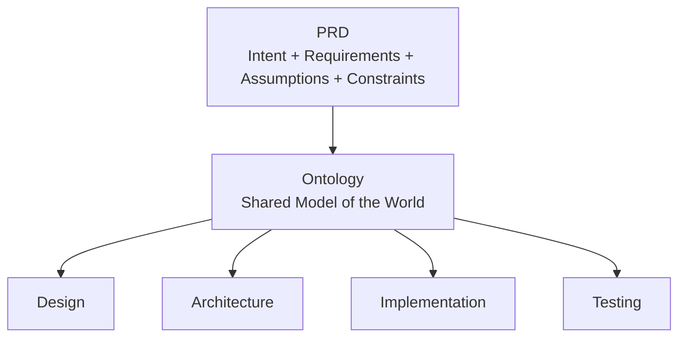

# Snapshot 004: Ontology as the Bridge

Date: 2026-06-30

Snapshot #004 refines the relationship between PRD and Ontology.

We no longer describe the PRD as only intent.

That was useful as a first approximation, but too small.

A PRD contains:

- Intent
- Requirements
- Assumptions
- Constraints

Every good PRD already contains an implicit model of the world.

ODPM makes that model explicit.

## What Ontology Contains

For now, ODPM keeps ontology simple:

- Concepts: the things that exist in the world.
- Relationships: how those things connect.
- Rules: what must be true.
- States: the meaningful conditions those things can be in.

## What Changed

- Ontology does not replace the PRD.
- Ontology extracts and organizes the shared model already implicit in the PRD.
- Design, architecture, implementation, and testing consume the same model.
- ODPM complements existing practices instead of competing with them.

## Visualization Standard

The previous visualization answer still holds:

Start with a glossary plus a lightweight relationship diagram.

The glossary gives precise definitions.

The diagram shows the most important relationships.

Together they make Ontology readable, versionable, and reviewable without requiring a heavy modeling tool.

## Why This Fits ODPM

- It keeps the repository simple.
- It works in Git and GitHub Markdown.
- It supports both precision and overview.
- It lets different audiences consume different views of the same Ontology.
- It treats visualization as a tool for Shared Understanding, not as an end in itself.

## Working Standard

Use Mermaid diagrams when relationships need to be visible.

Use glossary entries and concept cards when definitions need to be durable.

Preserve conversations when they explain how a concept emerged.
