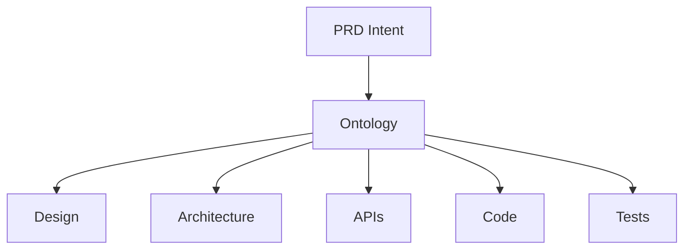

# Snapshot 004: Ontology Visualization

Date: 2026-06-30

Snapshot #004 captures the first practical answer to an open ODPM question:

How should Ontology be visualized?

## Current Answer

Start with a glossary plus a lightweight relationship diagram.

The glossary gives precise definitions.

The diagram shows the most important relationships.

Together they make Ontology readable, versionable, and reviewable without requiring a heavy modeling tool.

## Why This Fits ODPM

- It keeps the repository simple.
- It works in Git and GitHub Markdown.
- It supports both precision and overview.
- It lets different audiences consume different views of the same Ontology.
- It treats visualization as a tool for Shared Understanding, not as an end in itself.

## Working Standard

Use Mermaid diagrams when relationships need to be visible.

Use glossary entries and concept cards when definitions need to be durable.

Preserve conversations when they explain how a concept emerged.
