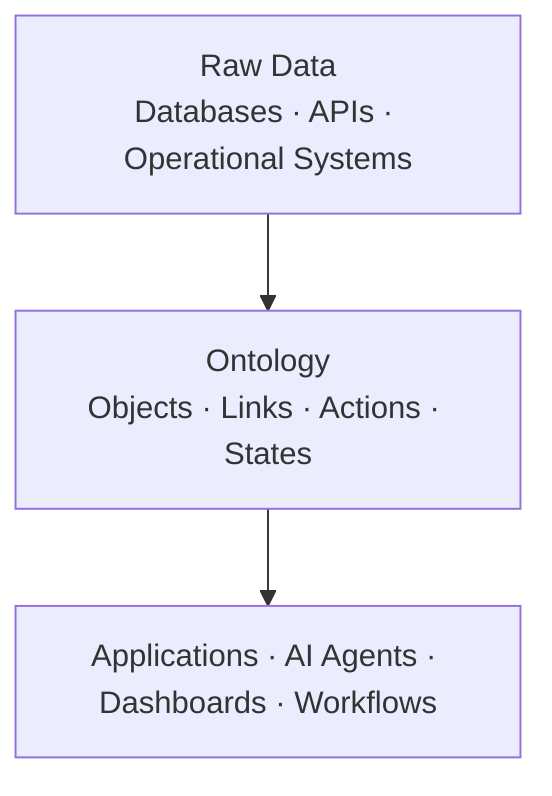

# Snapshot 006: When Ontology Becomes a Platform Layer

Date: 2026-06-30

ODPM treats ontology as a shared understanding artifact.

A glossary defines the concepts.

A diagram shows the relationships.

A team agrees on the rules and states.

That is where ODPM ends.

But ontology does not have to stay a document.

Palantir's Foundry platform shows what happens when ontology becomes a live technical layer.

---

## The Parallel Structure

ODPM's four building blocks map directly to Palantir's Ontology model.

| ODPM | Palantir | What it is |
|---|---|---|
| Concept | Object Type | A real-world entity: Aircraft, Patient, Shipment, Campaign |
| Relationship | Link Type | How objects connect: a Mission has Aircraft, a Patient has Encounters |
| Rule | Action | What can be done, under what conditions |
| State | Object State | Where an object is in its lifecycle |

The building blocks are the same.

The difference is form.

ODPM's ontology is a document. Palantir's ontology is deployed code.

---

## The Three-Layer Model, Operationalized

This is ODPM's three-layer model taken to its technical conclusion.

Where ODPM says design, architecture, implementation, and testing all consume the same ontology — Palantir makes that literal.

Every application queries the same objects, follows the same relationships, respects the same rules.

There is no per-application re-interpretation of what Aircraft or Patient means.

---

## The Key Move: Ontology That Writes Back

Most ontologies are read-only.

You look at the model, then build something separately.

Palantir's ontology is bidirectional.

- It reads from underlying systems. A Shipment's current state comes from a logistics database.
- It writes back. An Action — approve this order, escalate this alert — goes through the ontology and updates the source system.

A decision-maker, an AI agent, and a workflow are all touching the same object, in the same state, through the same rules.

---

## When AI Operates on the Ontology

Palantir's AIP makes the implication explicit.

AI agents do not query raw data. They operate on the ontology.

An agent in a military context sees:

- Aircraft (state: available / deployed / degraded / maintenance)
- Mission (state: planned / active / complete / aborted)
- Rule: an Aircraft in state `degraded` cannot be assigned to a high-priority Mission

The agent reasons with the same world model that human operators use.

This is why the ontology layer matters for AI safety and interpretability.

The agent's actions are understandable because they operate on human-meaningful concepts, not opaque data.

---

## What This Means for ODPM

ODPM and Palantir are not in conflict.

ODPM sits upstream. Palantir sits downstream.

ODPM produces the shared understanding that a Palantir implementation should encode.

If the team has done ODPM work — agreed on Concepts, Relationships, Rules, and States — the translation to Object Types, Link Types, Actions, and Object States is direct.

If the team skips the ODPM work, the Palantir ontology encodes someone's private understanding instead of a shared one.

---

## The Translation

When ODPM ontology needs to become a platform layer:

| ODPM artifact | Becomes |
|---|---|
| Concept card | Object Type definition |
| Relationship list | Link Type schema |
| Rules | Action conditions and guards |
| State list | Object State enumeration |
| Glossary entry | Object Type description and property definitions |

The ODPM work is not thrown away.

It becomes the specification the platform is built from.

---

## The Open Question

ODPM currently produces documents.

Palantir requires deployed artifacts.

The gap between them is an engineering translation step — one that is easier and safer when the ODPM ontology was built with care.

The question for future snapshots:

> Can the ODPM ontology format be designed to minimize the cost of that translation?
